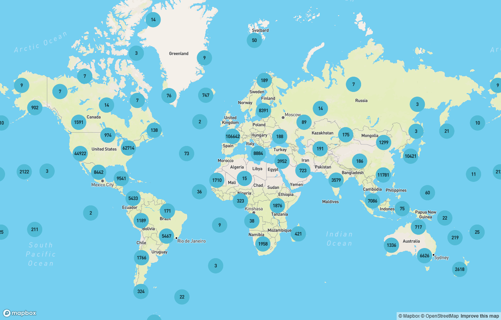
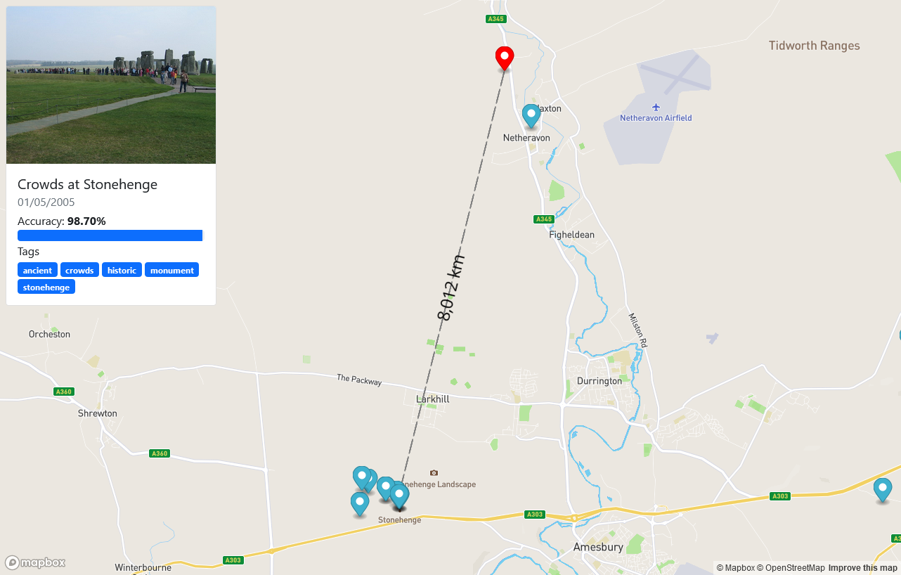

# Deep Location 

The Deep Location frontend is a web application that allows users to explore the [PlaNet](https://research.google/pubs/pub45488/) deep learning model on a subset of the YFCM100M dataset. The project was made as part of the course [Large Scale Data Engineering](https://event.cwi.nl/lsde) (LSDE 2022) at the Vrije Universiteit Amsterdam. The frontend is built using Vue.js and the map is rendered using MapBox.

## Screenshots





## Project Setup

```sh
npm install
```

### Compile and Hot-Reload for Development

```sh
npm run dev
```

### Compile and Minify for Production

```sh
npm run build
```
